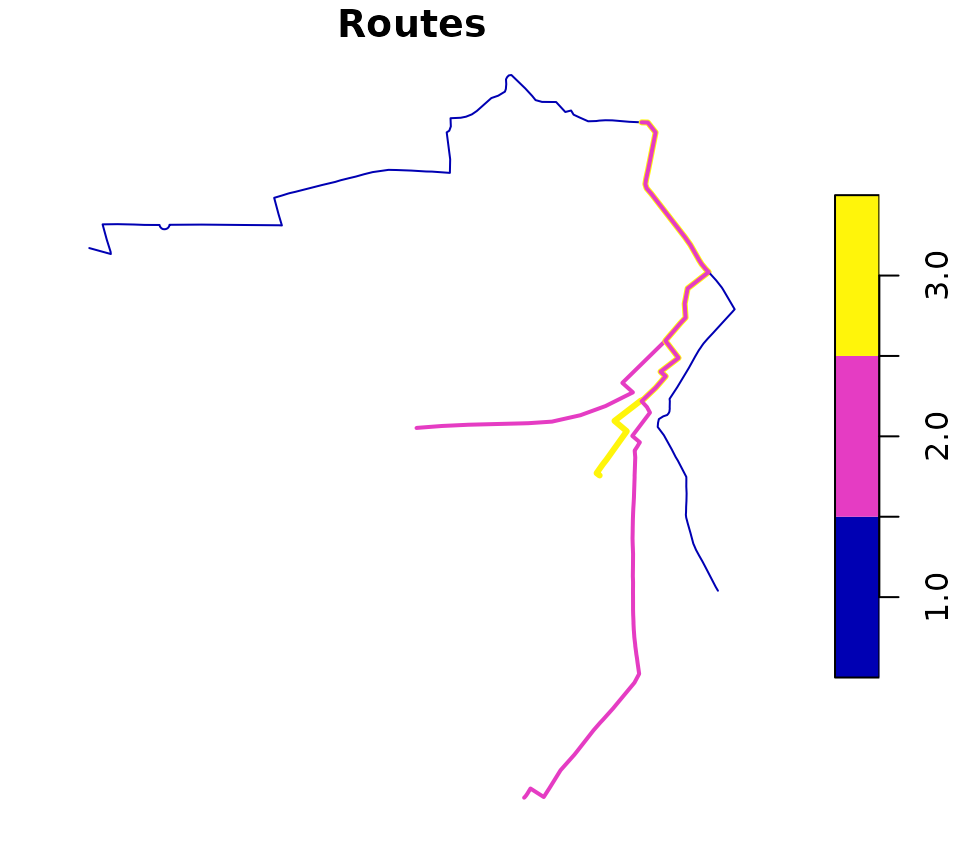
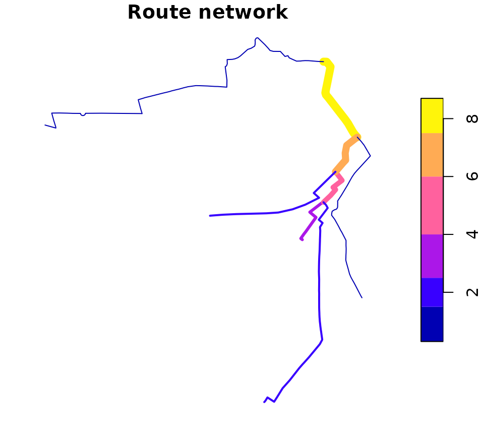

# Route networks with stplanr

``` r

library(stplanr)
library(sf)
```

## Introduction

Route networks represent the network of highways, cycleways, footways
and other ways along which transport happens. You can get route network
data from OpenStreetMap (e.g. via the `osmdata` R package) and other
providers or transport network data.

## Creating route networks from overlapping routes

Unlike routes, each segment geometry in a route network can only appear
once.

**stplanr** can be used to convert a series of routes into a route
network, using the function
[`overline()`](https://docs.ropensci.org/stplanr/reference/overline.md),
as illustrated below:

``` r

library(stplanr)
library(sf)
sample_routes <- routes_fast_sf[2:6, 1]
sample_routes$value <- rep(1:3, length.out = 5)
rnet <- overline(sample_routes, attrib = "value")
plot(sample_routes["value"], lwd = sample_routes$value, main = "Routes")
plot(rnet["value"], lwd = rnet$value, main = "Route network")
```



The above figure shows how
[`overline()`](https://docs.ropensci.org/stplanr/reference/overline.md)
breaks the routes into segments with the same values and removes
overlapping segments. It is a form of geographic aggregation.

## Identifying route network groups

Route networks can be represented as a graph. Usually all segments are
connected together, meaning the graph is
[connected](https://en.wikipedia.org/wiki/Connectivity_(graph_theory)#Connected_graph).
We can show that very simple network above is connected as follows:

``` r

touching_list = st_intersects(sample_routes)
g = igraph::graph.adjlist(touching_list)
#> Warning: `graph.adjlist()` was deprecated in igraph 2.0.0.
#> ℹ Please use `graph_from_adj_list()` instead.
#> This warning is displayed once per session.
#> Call `lifecycle::last_lifecycle_warnings()` to see where this warning was
#> generated.
igraph::is_connected(g)
#> [1] TRUE
```

A more complex network may not be connected in this way, as shown in the
example below:

``` r

# piggyback::pb_download_url("r_key_roads_test.Rds")
u = "https://github.com/ropensci/stplanr/releases/download/0.6.0/r_key_roads_test.Rds"
rnet_disconnected = readRDS(url(u))
touching_list = sf::st_intersects(rnet_disconnected)
g = igraph::graph.adjlist(touching_list)
igraph::is_connected(g)
#> [1] FALSE
sf:::plot.sfc_LINESTRING(rnet_disconnected$geometry)
```


The elements of the network are clearly divided into groups. We can
identify these groups as follows:

``` r

rnet_disconnected$group = rnet_igroup(rnet_disconnected)
```

## Routing on route networks

``` r

# plot(rnet$geometry)
# plot(sln_nodes, add = TRUE)
# xy_path <- sum_network_routes(sln = sln, start = xy_nodes[1], end = xy_nodes[2], sumvars = "length")
# # xy_path = sum_network_links(sln = sln, start = xy_nodes[1], end = xy_nodes[2])
# plot(rnet$geometry)
# plot(xy_sf$geometry, add = TRUE)
# plot(xy_path$geometry, add = TRUE, lwd = 5)
```

## Adding new nodes

New nodes can be added to the network, although this should be done
before the graph representation is created. Imagine we want to create a
point half way along the the most westerly route segment in the network,
near the coordinates -1.540, 53.826:

``` r

new_point_coordinates <- c(-1.540, 53.826)
p <- sf::st_sf(geometry = sf::st_sfc(sf::st_point(new_point_coordinates)), crs = 4326)
```

## Other approaches

Other approaches to working with route networks include:

- [sDNA](https://github.com/fiftysevendegreesofrad/sdna_open), an open
  source C++ library for analysing route networks and estimating flows
  at segments across network segments
- [sfnetworks](https://github.com/luukvdmeer/sfnetworks), an R package
  that provides an alternative igraph/sf spatial network class
- [dodgr](https://github.com/UrbanAnalyst/dodgr), an R package providing
  functions for calculating distances on directed graphs
- [cppRouting](https://cran.r-project.org/package=cppRouting), a package
  for routing in C++
- Chapter [10 of Geocomputation with
  R](https://r.geocompx.org/transport.html), which provides context and
  demonstrates a transport planning workflow in R.
